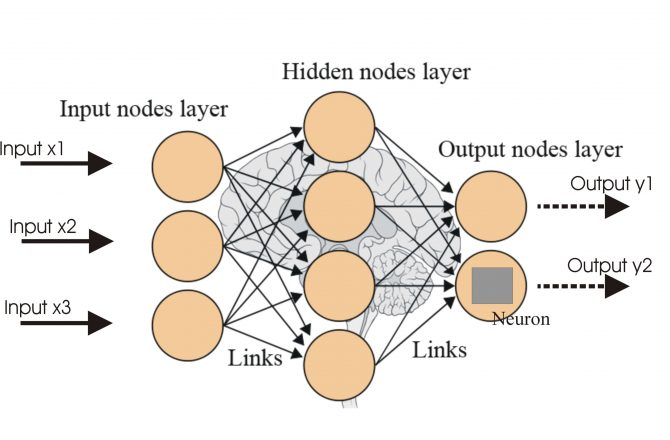
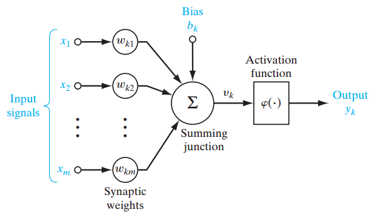
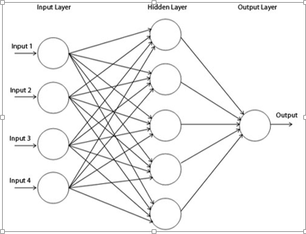

# Artificial Neural Networks

“Is it possible to predict the success or failure of a banking sales call before making it?”

---

## What is the problem we are solving here?
- **Context** As a Bank, it is our job to sell financial products and services to clients. This frequently takes the form of 'cold calling', which is making an unsolicited call on (someone), by telephone or in person, in an attempt to sell goods or services. 

**How do we ensure our cold calling efforts are correctly targetted?**

---

## Analysis and Preliminary Conclusion

- **Scenario** We just launched a new financial product and our sales agents attacked the phones with rarely seen enthusiam, however after a few weeks results are not as well as we hoped.
- On further examination we started to find some correlations between several demographics of clients and their decision to purchase our services or not. 

---

## What is Artificial Neural Networks?

---

## Single Layer Perceptron

---

## Multi-Layer Perceptron

---
## Activation Function

---

## Loss Function

--- 

## How to interpret results?

**Accuracy: %89**

Is this model any good?

---

## Confusion Matrix

|   	| 0  	| 1  	|
|---	|---	|---	|
| 0  	| 7890  	| 91  	|
| 1  	| 896  	| 166  	|

---

## Type I and II Errors

---

## Precision and Recall I

---

## Precision and Recall II

---

## Our precision and recall results
* Precision: 0.6071
* Recall: 0.1639

---

## Bias vs Variance Intro

---

## Bias vs Variance Trade-Off

---

## Area under ROC Curve I

---

## Area under ROC Curve II
- .90-1 = excellent (A)
- .80-.90 = good (B)
- .70-.80 = fair (C)
- .60-.70 = poor (D)
- .50-.60 = fail (F)

**our result is 0.502**

---

## Final Notes on Model Analysis

* Good Accuracy, High Precision/Low Recall. 
* Caveat here is, a lot of potential sales leads will fall through the cracks due to misclassification (low recall)
* Worst problem with the model comes from data itself... Class Imbalance. How many positive outcomes in comparison to negatives?

---
## More on Artificial Neural Networks
- https://www.analyticsvidhya.com/blog/2016/08/evolution-core-concepts-deep-learning-neural-networks/
- https://medium.com/data-science-group-iitr/loss-functions-and-optimization-algorithms-demystified-bb92daff331c
- https://stackoverflow.com/questions/47104129/getting-a-low-roc-auc-score-but-a-high-accuracy
- https://www.youtube.com/watch?v=F1ka6a13S9I